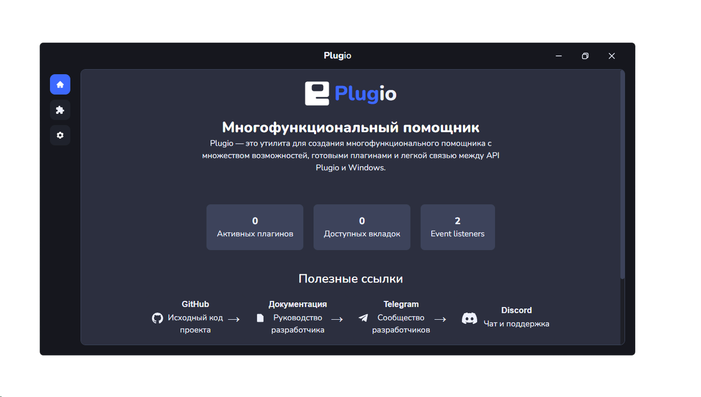
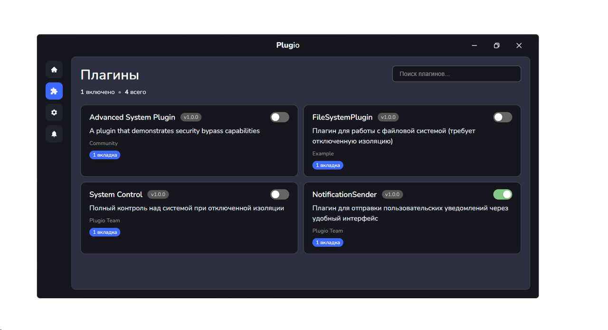

  <table border="0" cellpadding="0" cellspacing="0" width="100%">
    <tr>
      <td align="center" width="70">
        
      </td>
      <td align="left">
        

          <h1 style="margin: 0; font-size: 2.2em;">PlugIO</h1>
          

            Desktop plugin framework based on Electron + Vite
          

        

      </td>
    </tr>
  </table>

  <a href="README.md" style="text-decoration: none; font-weight: bold; color: #222;">
    
    Русский
  </a>
  &nbsp; &nbsp; | &nbsp; &nbsp;
  <a href="README_EN.md" style="text-decoration: none; font-weight: bold; color: #222;">
    
    English
  </a>

---

## Содержание
- [О проекте](#о-проекте)
- [Ключевые возможности](#ключевые-возможности)
- [Документация](#документация)
- [Статус проекта](#статус-проекта)
- [Автор](#автор)

---

## О проекте

PlugIO — ознакомительный проект десктопного приложения на базе Electron + Vite, демонстрирующий реализацию поддержки плагинов в desktop-приложениях. Проект поддерживает как системные, так и пользовательские плагины, обеспечивая гибкость и расширяемость архитектуры.

  
  &nbsp; &nbsp;
  

---

## Ключевые возможности

- Транспиляция TypeScript/TSX в реальном времени  
- Полная изоляция пользовательских плагинов для обеспечения безопасности  
- Поддержка пользовательских расширений «из коробки»  (AppData)
- Интеграция с Vite для быстрой разработки и горячей перезагрузки (HMR)

---

## Документация

Полная документация по архитектуре, API и способам интеграции доступна в отдельном репозитории и на официальном сайте:

-  [Онлайн-документация](https://plugio-docs.vercel.app/)
- [Исходный код документации на GitHub](https://github.com/Sobd22/plugio-docs)

---

## Статус проекта

Официальная поддержка проекта прекращена 26 июля 2025 года в связи с утратой перспектив развития.  
Проект завершён.

  
    
  <strong>Светлая память проекту.</strong> 
  Создано <a href="https://t.me/devii_dev">Devil</a> (@devii_dev)

---

<a href="https://t.me/devii_dev">
Связаться через Telegram </a>

---

  — PlugIO • Проект завершён • 2025 —

   