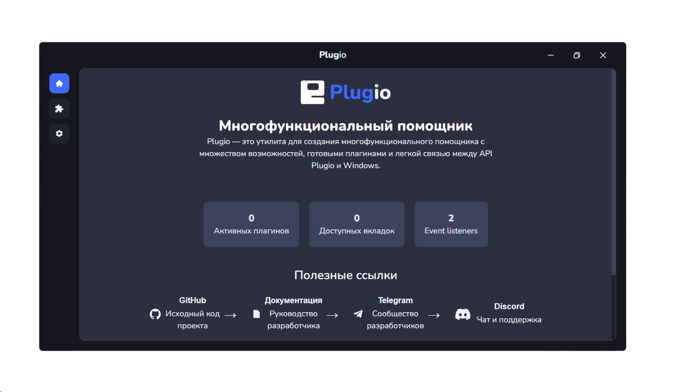
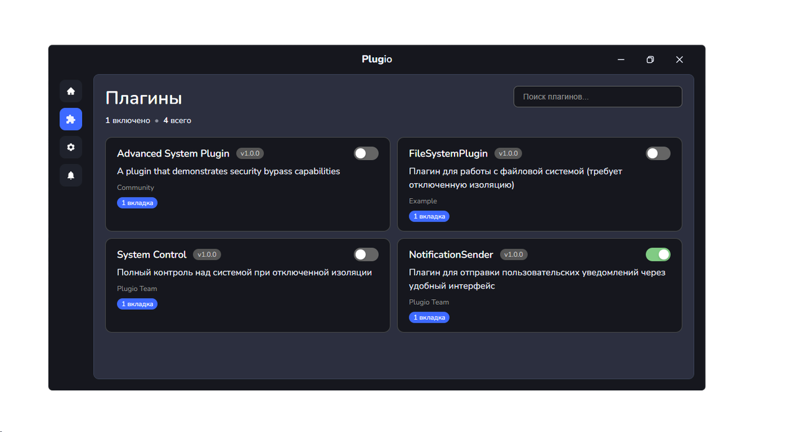

  <table border="0" cellpadding="0" cellspacing="0" width="100%">
    <tr>
      <td align="center" width="70">
        
      </td>
      <td align="left">
        

          <h1 style="margin: 0; font-size: 2.2em;">PlugIO</h1>
          

            Desktop plugin framework based on Electron + Vite
          

        

      </td>
    </tr>
  </table>

  <a href="README.md" style="text-decoration: none; font-weight: bold; color: #222;">
    
    Русский
  </a>
  &nbsp; &nbsp; | &nbsp; &nbsp;
  <a href="README_EN.md" style="text-decoration: none; font-weight: bold; color: #222;">
    
    English
  </a>

---

## Table of Contents
- [About](#about)
- [Key Features](#key-features)
- [Documentation](#documentation)
- [Project Status](#project-status)
- [Author](#author)

---

## About

PlugIO is an introductory desktop application project built on Electron + Vite, demonstrating a plugin-based architecture for desktop environments. The project supports both system and user plugins, providing flexibility and extensibility in application design.

  
  &nbsp; &nbsp;
  

---

## Key Features

- Real-time transpilation of TypeScript/TSX code  
- Full sandboxing of user plugins for enhanced security  
- Built-in support for custom extensions (via AppData)  
- Integration with Vite for fast development and Hot Module Replacement (HMR)

---

## Documentation

Complete documentation covering architecture, API, and integration methods is available in a dedicated repository and on the official website:

- [Online Documentation](https://plugio-docs.vercel.app/)  
- [Documentation Source on GitHub](https://github.com/Sobd22/plugio-docs)

---

## Project Status

Official support for the project was discontinued on July 26, 2025, due to the loss of development prospects.  
The project is complete.

  
    
  <strong>In loving memory.</strong> 
  Created by <a href="https://t.me/devii_dev">Devil</a> (@devii_dev)

---

  <a href="https://t.me/devii_dev">
    Contact via Telegram
  </a>

---

  — PlugIO • Project completed • 2025 —

